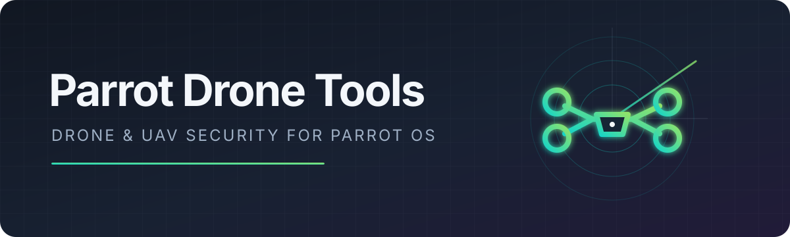

<p align="center">
  
</p>

<p align="center">
  <a href="https://www.parrotsec.org/"></a>
  
  <a href="LICENSE"></a>
  <a href="https://github.com/njones920/parrot-drone-tools/releases/tag/v7.4.0"></a>
</p>

Parrot Drone Tools turns a standard Parrot OS desktop into a focused drone and
UAV security workstation. It installs a curated, archive-native toolbox and adds
the missing **Drone & UAV** application-menu domain.

The first standalone release targets **Parrot OS 7.x on amd64**.

## What it adds

| Menu category | Working set |
|---|---|
| SDR & RF Analysis | GNU Radio, Gqrx, SDR++, Inspectrum, HackRF, rtl_433, SatDump |
| Remote ID & DroneID | Kismet and Parrot's AntSDR DJI DroneID capture helper |
| MAVLink & Ground Control | pymavlink tools and CAN/DroneCAN foundations |
| GNSS & GPS | GNSS-SDR, gpsd tools, GPS conversion and RTK foundations |
| Counter-UAS & Detection | ADS-B airspace awareness and capture/analysis foundations |
| Firmware & Hardware | Binwalk, Rizin, OpenOCD, flashrom, PulseView and serial tools |

The metapackage recommends the relevant SDR backends and Kismet capture helpers
already available in Parrot, so supported radios can be added later without
rebuilding the workstation.

## Quick start

### 1. Get the repository

```bash
git clone https://github.com/njones920/parrot-drone-tools.git
cd parrot-drone-tools
```

Release archives work too; the installer only needs the complete repository
contents.

### 2. Install

```bash
sudo ./install.sh
```

The installer will:

1. Confirm Parrot 7.x and amd64 before changing anything.
2. Confirm that the installed Parrot menu layout is compatible.
3. Verify both bundled packages against `SHA256SUMS`.
4. Install the compatibility package and `parrot-tools-drone` through APT.
5. Add seven menu categories and 23 launchers.
6. Run the same verification available to the user.

Expect approximately **2.4 GB** of archive downloads on a minimal installation.
Suggested packages are not installed automatically.

### 3. Verify

```bash
./verify.sh
```

Healthy output looks like:

```text
PASS  parrot-tools-drone 7.4.0
PASS  pymavlink 2.4.37
PASS  7 menu categories
PASS  23 application launchers
PASS  23 launchers protected from update-launchers
PASS  Drone & UAV menu registered once
```

The script is safe to run again. Existing menu integration is detected instead
of duplicated.

## Requirements

- Parrot OS 7.x desktop
- amd64 architecture
- Internet access to Parrot's package repositories
- `sudo`
- Approximately 2.4 GB for the recommended toolbox

No SDR, drone, radio, or GPU is required to install it.

## Why two bundled packages?

`parrot-tools-drone` is the small metapackage that defines the toolbox.
`python3-pymavlink` is rebuilt from Parrot's source with one compatibility patch:
Parrot's package, unchanged through 7.4, depends on the retired Python 2 `future`
library even though the shipped Python 3 code does not need it.

Both `.deb` files are committed with recorded SHA-256 sums. The metapackage's
Debian source and the complete pymavlink patch are included for inspection.
Everything else is resolved normally from Parrot.

## Scope

The baseline is built from Parrot's package archive. Hardware setup is left to
Parrot and the device vendor, while Damn Vulnerable Drone remains a separate
optional lab. See [package scope](docs/PACKAGE-SCOPE.md) and
[hardware notes](docs/HARDWARE.md).

## Uninstall

```bash
sudo ./uninstall.sh
```

This removes the Drone & UAV menu integration and metapackage. Tools previously
installed by APT are retained, avoiding a surprise mass-removal of software or
user data.

## Repository layout

```text
install.sh             guarded installer
verify.sh              read-only installation checks
uninstall.sh           conservative menu/metapackage removal
menu/                  7 categories, 23 launchers and menu patch
packages/              verified installable packages and checksums
packaging/              Debian source for parrot-tools-drone
patches/                pymavlink compatibility patch
docs/                   scope and hardware guidance
```

## License

Original project work is copyright © 2026 Nate Jones and released under
[GPL-3.0-or-later](LICENSE), matching Parrot's menu and conversion tooling.
Bundled and derived components retain their upstream copyrights and licenses;
see [third-party notices](THIRD_PARTY.md).
